# Build up your Lap

## High Level Goals

By the end of this lesson, you will be familiar with the following:

- what is our lap
- VirtualBox
- Kali Linux
- Run Kali in VirtualBox 
- OWASP & installation 
- windows & installation 

##  VirtualBox

### what is VirtualBox

Oracle VM VirtualBox is cross-platform virtualization software. It **allows users to extend their existing computer to run multiple operating systems** including Microsoft Windows, Mac OS X, Linux, and Oracle Solaria, at the same time.

### install VirtualBox

Go to [https://www.virtualbox.org/wiki/Downloads](https://www.virtualbox.org/wiki/Downloads) and click on Windows hosts

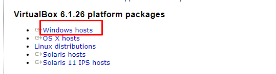

Then open the `VirtualBox-6.1.26-145957-Win` setup and download it.

## Kali Linux

### What is Kali Linux

Kali Linux (formerly known as Backtrack Linux) is an open-source, Debian-based Linux distribution aimed at advanced Penetration Testing and Security Auditing. Kali Linux contains several hundred tools targeted towards various information security tasks, such as Penetration Testing, Security Research, Computer Forensics and Reverse Engineering. Kali Linux is a multi platform solution, accessible and freely available to information security professionals and hobbyists.

## Kali Linux Installation

- Go to [https://www.kali.org/get-kali](https://www.kali.org/get-kali) and click in Recommended

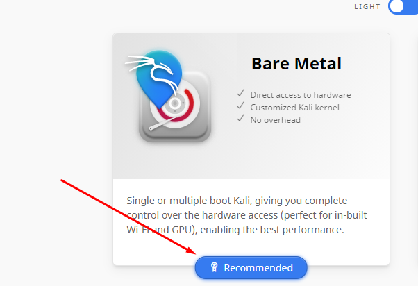

- Finally click in the download button

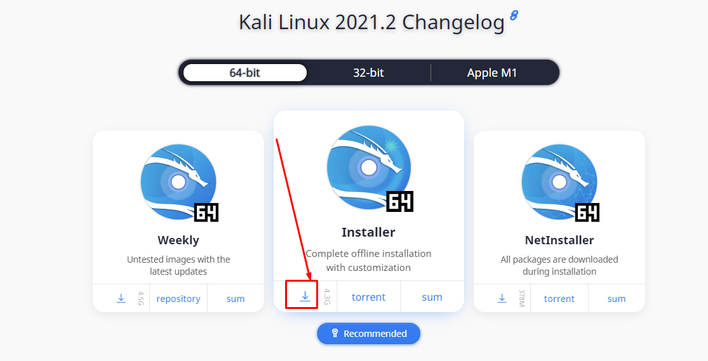

## Run Kali in VirtualBox 

### we will change some setting in VirtualBox before install the Kali-linux

1. Create new machine:

   - Click in `new`.
   - In the `Name` section write `Kali`.
   - In the `Type` section select `Linux`.
   - In the `Version` section select `Debian (64-bit)`.
   - Change the `1024` to `2024`.
   - Press next and in the `File location size` change the `8.00 GB` to `50.0 GB`.

2. now we must change some setting

   - Go to `Settings`.
   - On the left side go to `Storage` and press in `Controller: IDE O+` and click in `Add` then chose the `kali-linux.iso file` and press ok.
   - Go to the `Network` and select `Attached to` and choose `Bridged Adapter`.

- Note: What is `Bridged Adapter` and why we used it

Bridged Adapter This mode is used for connecting the virtual network adapter of a VM to a physical network to which a physical network adapter of the VirtualBox host machine is connected.

A VM virtual network adapter uses the host network interface for a network connection. Put simply, network packets are sent and received directly from/to the virtual network adapter without additional routing. A special net filter driver is used by VirtualBox for a bridged network mode in order to filter data from the physical network adapter of the host.

- Note: to read more about the Network, visit [link](https://www.nakivo.com/blog/virtualbox-network-setting-guide)

### Now we are going to install Kali-linux

1.  Click `Start`.
2.  Press in `Graphical install`.

3.  Select language:

- 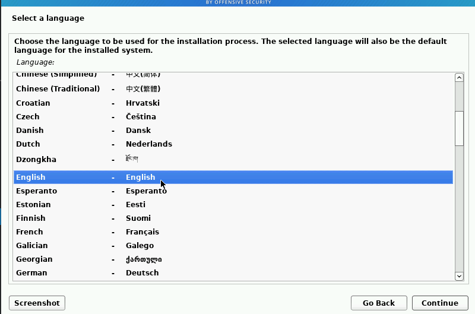
- 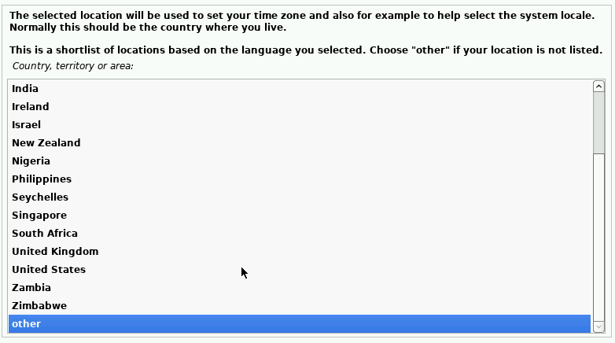
- 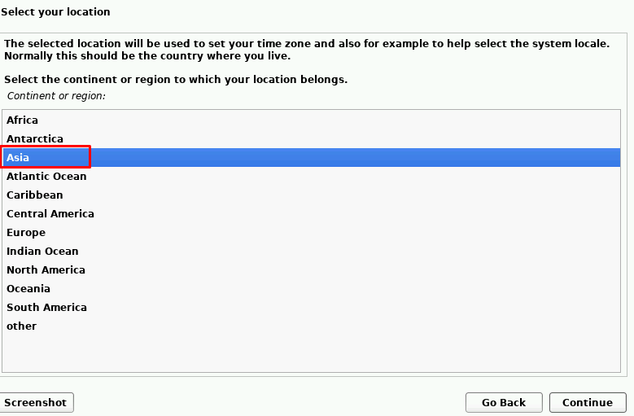
- 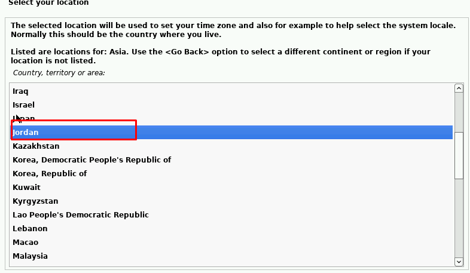

4. In configure the network:

   - `Hostname` write `Kali`.
   - `Domainname` make it empty.

5. set up the users and passwords:

   - `Full name for the new user` write `anything you like`.
   - `user for the account` make it default.
   - `password` make it `root`.

6. Partition disk:

   - `Partitioning methoud` should be `Guided-use entire disk`.
   - `Select disk to partition` make it default.
   - `Partitioning schema` choose `All files in one partition (recommended for new users)`.
   - `write change to diske` make sure to be `Yes`.

7. Software selection: - choose software to install:
   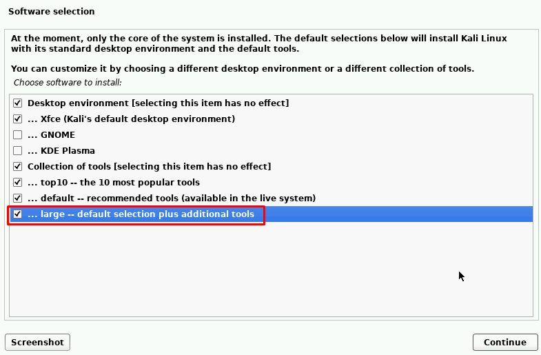

8. Install the GRUB bootloader
   - `Install the GRUB boot loader to your primary drive` make sure it is `Yes`.
   - `Device for boot loader installaion` choose the `/dev/sda (ata-VBOX_HARDDISK_VB894idi83-a88d4993)`.

### Now our Kali-linux are ready, make sure you have like picture

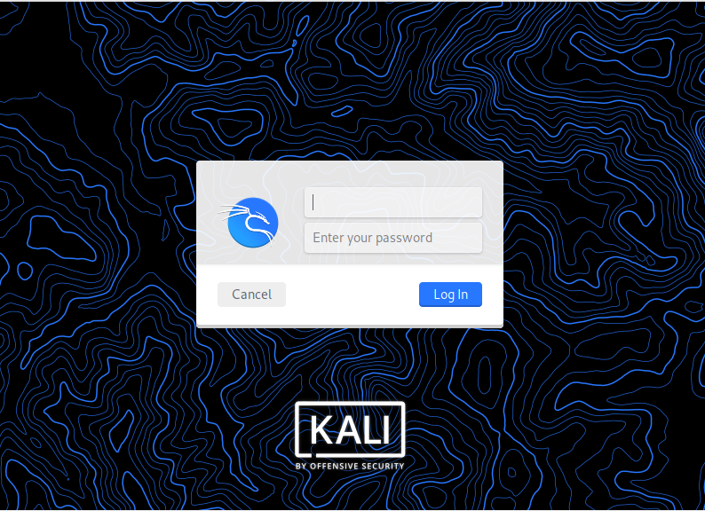.

**Note:** use the username and the password that you add it in the installation.

## OWASP & installation 

### What is OWASP 

The Open Web Application Security Project is an online community that produces freely-available articles, methodologies, documentation, tools, and technologies in the field of web application security. The Open Web Application Security Project provides free and open resources.

### Install OWASP

1. Go to [https://sourceforge.net/projects/owaspbwa](https://sourceforge.net/projects/owaspbwa).

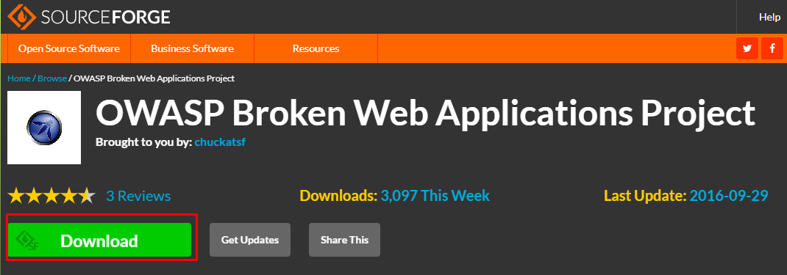

2. Extract the file, then open your VirtualBox.

3. OWASPBWA installation:

- Click in `New`.

- In the `Name` write `OWSPBWA` and in the `Type` select, `Linux` finally in the `Version` choose `Other Linux (64-bit)`.

- In the `Memory size` make sure it is `1024`.

- In the `Hardesk selector` choose `Use an existing virtual hard disk file`, then do like the images:

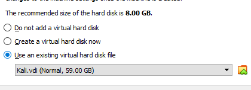

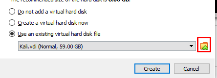

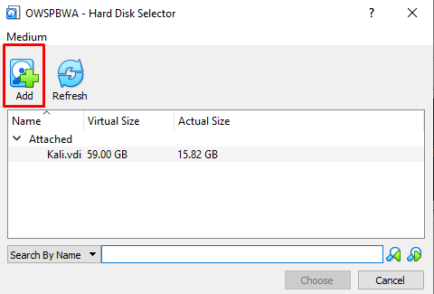

- Select the file you are download it `OWASP_Broken_Web_Apps_VM_1.2`.

- Choose the first one `OWASP Broken Web Apps-cl1`.

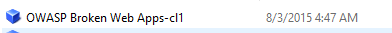

- Finally, press create.

4. Run the `OWASPBWA`:

- make sure the `Network` Attached to `Bridged Adapter` before you start

- Now Click in `Start`

- You should have like this

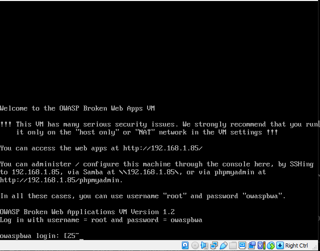

- Now for `login` write `root` and the `password` is `owaspbwa`

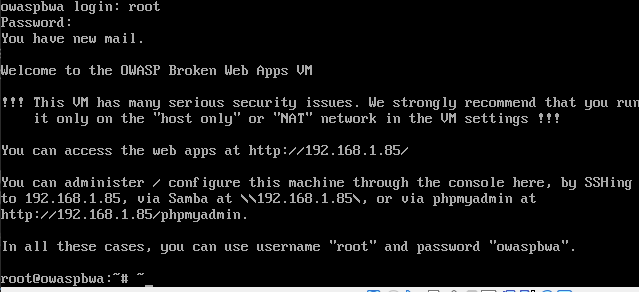

- Now you can visit this IP address `192.168.1.85` in your browser

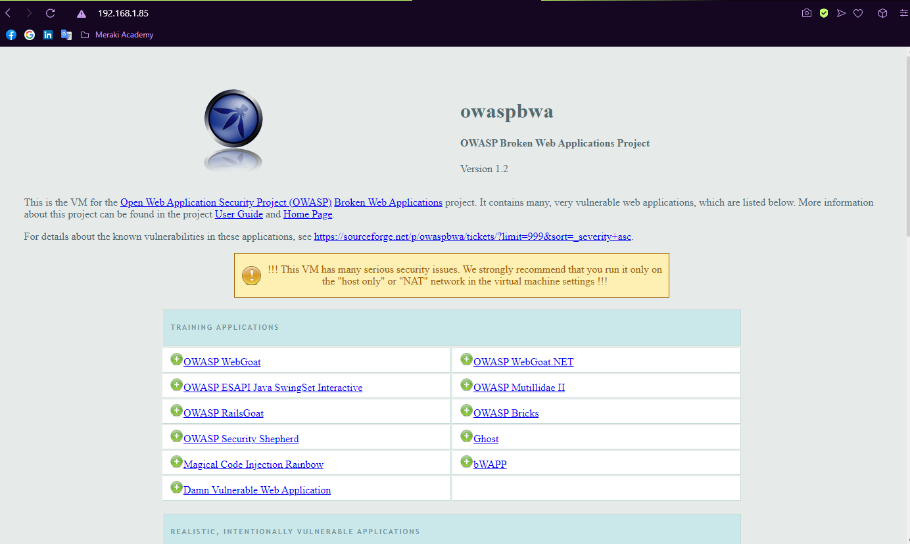
