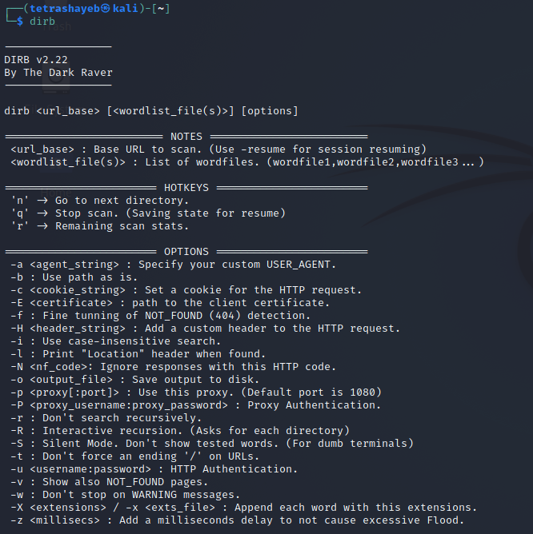
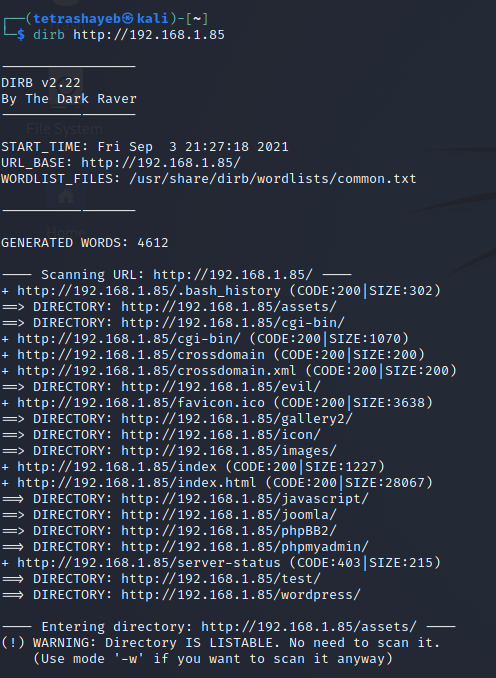
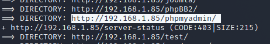
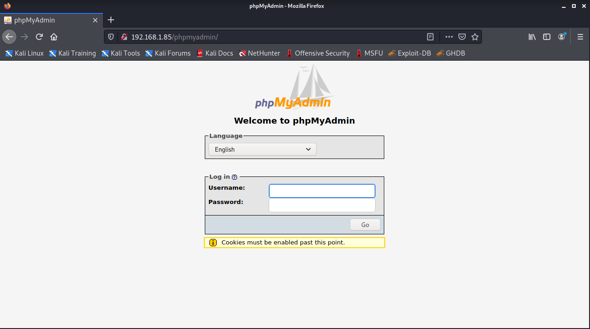

# Information Gathering

## High Level Goals

By the end of this lesson, you will be familiar with the following:

1. Google Dorks
2. Ping, Host, Nslookup, Whois
3. whatweb
4. Dirb
5. Nmap
6. Nikto

## Google Dorks

A Google dork query, sometimes just referred to as a dork, is a search string that uses advanced search operators to find information that is not readily available on a website.

A search parameter is a limitation applied to a search. Here are a few examples of advanced search parameters:

| parameter    | usage                                                                                                                                                                                                         |
| ------------ | ------------------------------------------------------------------------------------------------------------------------------------------------------------------------------------------------------------- |
| **site**     | returns files located on a particular website or domain.                                                                                                                                                      |
| **filetype** | followed (without a space) by a file extension returns files of the specified type, such as DOC, PDF, XLS and INI. Multiple file types can be searched for simultaneously by separating extensions with “\|”. |
| **inurl**    | followed by a particular string returns results with that sequence of characters in the URL.                                                                                                                  |
| **intext**   | followed by the searcher’s chosen word or phrase returns files with the string anywhere in the text.                                                                                                          |

## Ping, Host, Nslookup, Whois

### Ping

The ping command is useful for determining the status of the network and various foreign hosts, tracking and isolating hardware and software problems, and testing, measuring, and managing networks. We can used it by typing `ping (our IP target)`

    ping 192.168.1.85

As we see the output

    PING 192.168.1.85 (192.168.1.85) 56(84) bytes of data.
    64 bytes from 192.168.1.85: icmp_seq=1 ttl=64 time=1.00 ms
    64 bytes from 192.168.1.85: icmp_seq=2 ttl=64 time=0.438 ms
    64 bytes from 192.168.1.85: icmp_seq=3 ttl=64 time=0.478 ms

It is mean the server with the IP `192.168.1.85` is running now, we can scan as domain name not only IP address. Let's scan `google.com`

    ┌──(tetra㉿kali)-[~]
    └─$ ping google.com                                                    130x
    PING google.com(mrs09s09-in-x0e.1e100.net (2a00:1450:4006:807::200e)) 56 data bytes
    64 bytes from mrs08s05-in-x0e.1e100.net (2a00:1450:4006:807::200e): icmp_seq=1 ttl=115 time=133 ms
    64 bytes from mrs08s05-in-x0e.1e100.net (2a00:1450:4006:807::200e): icmp_seq=2 ttl=115 time=55.7 ms
    64 bytes from mrs08s05-in-x0e.1e100.net (2a00:1450:4006:807::200e): icmp_seq=3 ttl=115 time=55.3 ms
    64 bytes from mrs08s05-in-x0e.1e100.net (2a00:1450:4006:807::200e): icmp_seq=4 ttl=115 time=55.5 ms
    64 bytes from mrs08s05-in-x0e.1e100.net (2a00:1450:4006:807::200e): icmp_seq=5 ttl=115 time=53.1 ms
    64 bytes from mrs08s05-in-x0e.1e100.net (2a00:1450:4006:807::200e): icmp_seq=6 ttl=115 time=55.4 ms
    64 bytes from mrs08s05-in-x0e.1e100.net (2a00:1450:4006:807::200e): icmp_seq=7 ttl=115 time=54.9 ms

We can know what is the IP address that google using it, it is `mrs09s09-in-x0e.1e100.net` but the `ping` commands it doesn't necessary always telling the troth, some website might block thing probs, and we might know to be able to ping them however they could still be online, so don't worry if the ping does not work perfectly.

### Host

Host command is used for DNS (Domain Name System) lookup operations. In simple words, this command is used to find the IP address of a particular domain name or if you want to find out the domain name of a particular IP address, the host command becomes handy. You can also find more specific details of a domain by specifying the corresponding option along with the domain name.

Syntax:

    host [-aCdlriTWV] [-c class] [-N ndots] [-t type] [-W time]
         [-R number] [-m flag] hostname [server]

Host IP_Address: This will display the domain details of the specified IP Address, let's scan `tesla.com` by using this command `host tesla.com`

    ┌──(tetra㉿kali)-[~]
    └─$ host tesla.com
    tesla.com has address 199.66.11.62
    tesla.com mail is handled by 10 tesla-com.mail.protection.outlook.com.

### Nslookup

The **nslookup** command queries internet domain name servers in two modes. Interactive mode allows you to query name servers for information about various hosts and domains, or to print a list of the hosts in a domain. In noninteractive mode, the names and requested information are printed for a specified host or domain.

It's like host, we can run this command `nslookup tesla.com`

    ┌──(tetra㉿kali)-[~]
    └─$ nslookup tesla.com
    Server:         192.168.1.1
    Address:        192.168.1.1#53

    Non-authoritative answer:
    Name:   tesla.com
    Address: 199.66.11.62

### Whois

Whois searches for an object in a WHOIS database. WHOIS is a query and response protocol that is widely used for querying databases that store the registered users of an Internet resource, such as a domain name or an P address block, but is also used for a wider range of other information. Let's scan `tesla.com`

    whois tesla.com

then we're getting some phones numbers, getting name servers and some postal code, we get information about admins organization, city, phone number and some other's information.

## whatweb

WhatWeb identifies websites. It recognizes web technologies including content management systems (CMS), blogging platforms, statistic/analytics packages, JavaScript libraries, web servers, and embedded devices.

WhatWeb has over 900 plugins, each to recognize something different. It also identifies version numbers, email addresses, account IDs, web framework modules, SQL errors, and more.

## Dirb

DIRB is a Web Content Scanner. It looks for existing (and/or hidden) Web Objects. It basically works by launching a dictionary based attack against a web server and analyzing the response.

DIRB comes with a set of preconfigured attack word lists for easy usage, but you can use your custom word lists. Also, DIRB sometimes can be used as a classic CGI scanner, but remember is a content scanner not a vulnerability scanner.

DIRB main purpose is to help in professional web application auditing. Specially in security related testing. It covers some holes not covered by classic web vulnerability scanners. DIRB looks for specific web objects that other generic CGI scanners can’t look for. It doesn’t search vulnerabilities nor does it look for web contents that can be vulnerable.

- Open your terminal and write `dirb`

- Note: make sure you are opening your OWASP server

* Write this command `dirb http://192.168.1.85` to generate a dictionary from our server

- Now we can go in our browser and use any directory from the `dirb` such as let's use `http://192.168.1.58/phpmyadmin/`

and we will see this

